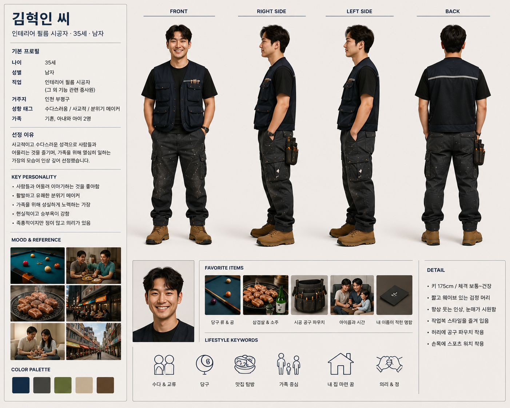
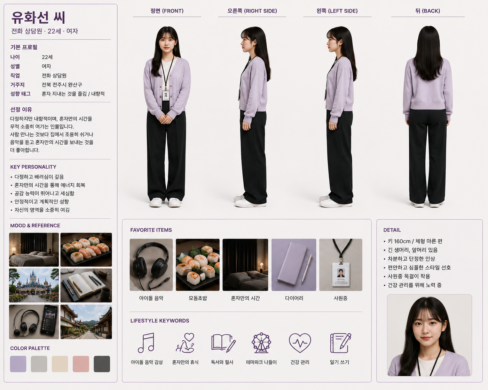

# 2주차 과제 — 페르소나 캐릭터 제작 & 멀티 에이전트 대화 시뮬레이션

1주차 EDA에서 사용한 [`nvidia/Nemotron-Personas-Korea`](https://huggingface.co/datasets/nvidia/Nemotron-Personas-Korea)
데이터셋에서 주민 3명을 선정해 (1) 캐릭터 이미지를 제작하고, (2) 동일한 상황을 주고 LLM으로
각자의 페르소나에 맞게 **대화하고 행동(방문/구매/검색 등)**하는지 시뮬레이션했습니다.
로컬 3B 모델과 상용 API(OpenAI)를 모두 실행해 비교했습니다.

## 1. 캐릭터

| | 우태은 | 김혁인 | 유화선 |
|---|---|---|---|
| 나이/성별 | 33세 / 여자 | 35세 / 남자 | 22세 / 여자 |
| 직업 | 의상 디자이너 | 인테리어 필름 시공자 | 전화 상담원 |
| 거주지 | 서울 강서구 화곡동 | 인천 부평구 | 전북 전주시 완산구 |
| 성향 | 절제된 미학, 조용한 자기만의 시간을 중시 | 사교적, 왁자지껄, 분위기 메이커 | 다정하지만 내향적, 혼자만의 시간 선호 |
| 선정 근거 | 1주차에 UUID로 고정 선정 | "사교적인 가장", "왁자지껄하게 수다" 등 키워드 최고점(남) | "내향적", "혼자만의 시간" 등 키워드 최고점(여) |

성비는 여자 2명(우태은·유화선) : 남자 1명(김혁인) = **2:1**로 구성했습니다.
각 캐릭터의 정면/오른쪽/왼쪽/뒷모습 캐릭터 시트는 `characters/` 폴더를 참고하세요.





상세 페르소나 설명(Nemotron 데이터셋 원문 기반)은 `personas/01_우태은.md`, `02_김혁인.md`,
`03_유화선.md`를 참고하세요.

## 2. 시뮬레이션 설계

- **데이터셋**: nvidia/Nemotron-Personas-Korea (100만 행 중 20만 행 샘플링, 키워드 점수 기반 선정 — `select_personas.py`)
- **상황(situation)**: "화곡동에 새로운 편집숍이 오픈해서 SNS에 소식이 떴다."
- **방법**: 세 주민이 순서대로(우태은 → 김혁인 → 유화선) 라운드를 돌며 발언. 매 라운드마다 지금까지의
  전체 대화 기록을 다음 화자의 프롬프트에 포함시켜, 서로의 발언을 참고해 반응하도록 설계.
  출력은 `{"dialogue": ..., "action": "방문|구매|검색|무반응", "action_detail": ...}` JSON 형식으로 강제.
- **비교한 3가지 실행**:

| | v1 (로컬 3B) | v2 (로컬 3B) | v3 (상용 API) |
|---|---|---|---|
| 엔진/모델 | Qwen2.5-3B-Instruct (CPU) | Qwen2.5-3B-Instruct (CPU) | OpenAI gpt-5.4-mini |
| 라운드 수 | 3 | 4 | 4 |
| 라운드별 질문 | 매 라운드 동일 | 라운드마다 다른 질문 (반응→구체화→같이/혼자 여부→결론) | 라운드마다 다른 질문 (v2와 동일 구조) |
| 생성 옵션 | `temperature=0.7` | `temperature=0.8`, `repetition_penalty=1.3` | 기본 설정 |
| 비용 | 무료 | 무료 | 유료 (실제 과금 1회 실행 기준 100원 미만) |

## 3. 결과: 로컬 3B

### v1 (3라운드, 기본 프롬프트) — 3라운드째 발췌
```
[우태은] "김혁인 씨가 오픈 정보를 찾아볼게요? 그럼 저는 오픈 준비물들을 다시 한번 체크해야겠네요.
         김혁인 씨와 함께 준비를 돕자." (행동: 검색 - 편집숍의 오픈 준비물들 확인을 위해 웹을 검색 중)
[김혁인] "준비물들은 이미 잘 정리되어 있으니 걱정마세요. 오픈 정보를 찾아볼게요."
         -> (검색: 편집숍의 오픈 정보를 찾아보기 위한 웹 검색을 시작함)
[유화선] "오픈 정보와 준비물들을 확인해드릴게요. 혹시 특별한 준비물이 필요한 부분이 있나요?"
         -> (검색: 편집숍의 오픈 정보와 준비물들을 찾아보러 검색 중)
```
**관찰**: 세 명 모두 "검색"으로 수렴하고 대사도 서로 거의 비슷하게 반복됨. 페르소나별 차별점이
행동에서 거의 드러나지 않음.

### v2 (4라운드, 질문별 진행 + 반복 억제 옵션) — 1·3·4라운드 발췌
```
=== 1라운드 ===
[유화선] "그래~ 그런 좋은 소식! ... 좀더 자료蒐합해야겠네요."   ← 한자 "蒐" 혼입, JSON 파싱 실패

=== 3라운드 ===
[우태은] "저희 세인都 함께 가볼까 하는건데 어떠하시죠?" -> (訪問: ...)   ← 한자 "都","訪問" 혼입
[김혁인] "혼자가 되어서 진행하면 효율적이겠다요." -> (None: None)        ← 수다스러운 페르소나와 모순되는 응답

=== 4라운드 ===
[김혁인] "...여러분들의 努力때문인지라 존중드립니다."   ← 한자 "努力" 혼입
```
**관찰**: 라운드별 질문과 반복 억제 옵션 덕분에 v1보다 대사 다양성은 늘었지만, 대신 **한자 혼입**
(Qwen이 중국어 기반 모델), **JSON 파싱 실패 증가**, **화자 의도와 반대로 응답하는 오류**(수다스러운
김혁인이 "혼자 하자"고 응답)가 새로 나타남. 반복 억제 튜닝이 다른 종류의 불안정성을 유발한 트레이드오프.

## 4. 결과: 상용 API (OpenAI gpt-5.4-mini)

v2와 동일한 4라운드·라운드별 질문 구조로 실행. 전체 발췌:

```
=== 1라운드 ===
[우태은] 오, 화곡동에 새 편집숍이 생겼네요. 동선 괜찮으면 주말에 한 번 들러서 원단감이랑
         기본 아이템 구성부터 봐야겠어요. -> (검색: SNS와 지도에서 매장 위치, 취급 브랜드,
         운영시간을 확인한다.)
[김혁인] 아, 화곡동 주변에 편집숍 생겼구나! 요새 기본 아이템 잘 뽑는 데가 귀하더라고,
         나도 동선만 괜찮으면 구경 한번 가보려고. -> (검색: 편집숍 위치와 운영시간,
         주력 상품 구성을 간단히 찾아본다.)
[유화선] 맞아요, 기본 아이템 잘 고르는 데는 한 번쯤 볼 만한데. 저는 주말에 사람 많은 건
         좀 부담돼서, 운영시간이랑 방문객이 적은 시간대를 먼저 확인해볼 것 같아요.
         -> (검색: 편집숍의 운영시간과 방문객이 적은 시간대를 확인한다.)

=== 2라운드 ===
[우태은] 유화선님 말처럼 붐비는 시간은 좀 낮겠네요. 저는 오픈 초기면 토요일 오전에 가서
         20~30분 정도만 빠르게 보고, 원단감이랑 세탁 라벨부터 확인해볼게요.
[김혁인] 오, 그거 괜찮네. 나도 괜히 피크 시간에 가서 사람에 치이기보단 토요일 오전에
         잠깐 들러서 기본 아이템만 빠르게 보고 나올래요. 동선 애매하면 아예 일 끝나고
         평일 저녁에 잠깐 스치듯 보는 쪽으로 바꿔도 되고요.
[유화선] 네, 김혁인님 말처럼 평일 저녁도 괜찮다면 굳이 토요일 오전에 안 맞춰도 되겠네요.
         저는 퇴근길에 한 번 들러서 30분 정도만 보고, 너무 붐비면 바로 나오는 쪽으로
         할 것 같아요.

=== 3라운드 ===
[우태은] 유화선님처럼 짧게 보고 빠지는 방식이면 부담이 적겠네요. 저는 같이 간다면
         원단감이랑 봉제 마감만 서로 다른 시선으로 확인하고, 아니면 아예 혼자 가서
         조용히 비교해보는 쪽이 더 편해요.
[김혁인] 맞아요, 우태은님처럼 같이 가면 서로 보는 포인트가 달라서 더 괜찮죠. 저도 같이
         가면 원단감이랑 마감 상태는 같이 보고, 저는 실용성 쪽으로만 좀 재빨리 체크하고
         싶어요.
[유화선] 네, 김혁인님 말씀처럼 같이 가면 각자 보는 기준이 달라서 놓치는 걸 덜 수 있겠네요.
         다만 저는 너무 오래 붙어 다니는 건 좀 힘들어서, 필요할 때만 같이 보고 나머지는
         혼자 천천히 둘러보고 싶어요.

=== 4라운드 ===
[우태은] 유화선님 말이 제일 현실적이네요. 저는 아예 혼자 가거나, 같이 가더라도 초반에만
         잠깐 보고 각자 흩어지는 방식으로 정리할게요.
[김혁인] 맞아요, 그게 제일 편하죠. 저도 같이 가더라도 초반에만 같이 보고, 바로 각자
         필요한 거 챙겨서 빠지는 걸로 할게요.
[유화선] 네, 그 방식이 딱 좋겠어요. 저는 퇴근길에 한 번 들러서 짧게 보고, 붐비면 오래
         안 머무르고 바로 나올게요.
```

**관찰**: 세 페르소나가 뚜렷이 구분됨 — 우태은은 원단·마감 등 전문적 기준으로 판단(의상
디자이너 반영), 김혁인은 유연하고 사교적으로 동조하면서도 실용성을 챙김(수다스러움 반영),
유화선은 시종일관 "혼잡 회피·짧게·혼자"를 관철함(내향적 성향 반영). 라운드가 진행될수록
세 사람이 서로의 발언을 반영해 **"짧게 들르고 각자 흩어지기"라는 절충안으로 자연스럽게
수렴**함 — 형식 오류(JSON 파싱 실패, 한자 혼입) 전혀 없음.

## 5. 비교 분석

| 평가 항목 | v1 (로컬 3B, 3라운드) | v2 (로컬 3B, 4라운드) | v3 (OpenAI gpt-5.4-mini, 4라운드) |
|---|---|---|---|
| 페르소나 반영도 | 낮음 — 세 명 모두 비슷한 행동으로 수렴 | 중간 — 대사는 다양해졌으나 행동/의도 일부 불일치 | **높음** — 직업·성향이 판단 기준·말투에 명확히 반영됨 |
| 유의미한 소통 | 낮음 — 응답이 사실상 동일 패턴 반복 | 중간 — 이름 언급은 하나 화자 혼동 발생 | **높음** — 서로 이름 언급, 의견 반영, 합의로 수렴 |
| 형식 안정성(JSON) | 대체로 안정적, 간헐적 파싱 실패 | 파싱 실패 빈도 증가, 한자 혼입 | **완전 안정** — 오류 0건 |
| 대화의 다양성 | 낮음 (반복적) | 높음 (품질 저하 동반) | **높음 (품질 저하 없이)** |

**핵심 발견**: 3B 소형 로컬 모델은 반복 억제와 형식·언어 안정성을 동시에 만족시키기 어려운
반면, 상용 대형 API(OpenAI gpt-5.4-mini)는 같은 프롬프트 구조에서 페르소나 반영, 상호 반응,
형식 준수를 모두 만족시켰다. 이는 **모델 파라미터 규모 차이가 페르소나 에이전트 시뮬레이션
품질에 직접적인 영향을 준다**는 것을 보여주는 결과다.

## 6. 결론

- 페르소나 정보를 시스템 프롬프트에 담고 대화 기록을 누적 전달하는 구조는 3개 실행 모두에서
  정상 작동함 — 구조 자체의 문제가 아니라 모델 능력의 문제였음을 확인.
- 3B 로컬 모델은 무료로 실행 가능하지만, 페르소나 차별화·형식 준수·언어 일관성에서 한계를
  보였고, 반복을 줄이려는 튜닝이 오히려 한자 혼입·응답 모순 등 새로운 문제를 유발함(트레이드오프).
- 상용 API(OpenAI gpt-5.4-mini)는 동일 조건에서 세 페르소나의 차별화된 판단 기준과 자연스러운
  합의 도출까지 보여주며, 페르소나 에이전트 시뮬레이션에 필요한 두 가지 평가 기준(페르소나
  반영도, 유의미한 소통)을 모두 충족함.

## 7. 파일 구성

```
2_persona_agent_chat/
├── README.md                 ← 이 파일 (실험 리포트)
├── requirements.txt          ← 상용 API(Claude/OpenAI/Gemini) 실행용 패키지
├── requirements-local.txt    ← 로컬 3B 모델 실행용 추가 패키지
├── .env.example               ← API 키 템플릿
├── select_personas.py        ← 데이터셋에서 주민 3명 선정 → personas/residents.json 생성
├── persona_chat.py            ← 대화 시뮬레이션 실행 스크립트 (--engine api|openai|gemini|local)
├── characters/                ← 캐릭터 이미지 (정면/오른쪽/왼쪽/뒷모습)
│   ├── 01_우태은.png
│   ├── 02_김혁인.png
│   └── 03_유화선.png
├── personas/
│   ├── residents.json
│   ├── 01_우태은.md
│   ├── 02_김혁인.md
│   └── 03_유화선.md
└── outputs/
    ├── chat_log_v1_local_3rounds.json          ← v1: 로컬 3B, 3라운드, 기본 프롬프트
    ├── chat_log_v2_local_4rounds_roundprompts.json  ← v2: 로컬 3B, 4라운드, 질문+반복억제 튜닝
    └── chat_log_v3_openai_4rounds.json         ← v3: OpenAI gpt-5.4-mini, 4라운드
```

---

## 실행 방법 (VSCode)

### 1) 가상환경 & 패키지 설치
```bash
cd 2_persona_agent_chat
python -m venv .venv
# Windows: .venv\Scripts\Activate.ps1  /  macOS·Linux: source .venv/bin/activate
pip install -r requirements.txt
pip install -r requirements-local.txt   # 로컬 3B도 쓸 경우
```

### 2) API 키 설정
```bash
cp .env.example .env
```
`.env`에 `ANTHROPIC_API_KEY`, `OPENAI_API_KEY`, `GEMINI_API_KEY` 중 사용할 것을 채워 넣습니다.

### 3) 실행
```bash
# 로컬 3B (무료, 느림)
python persona_chat.py --engine local --rounds 4

# OpenAI (유료, 소규모 실행 시 비용 미미)
python persona_chat.py --engine openai --model gpt-5.4-mini --rounds 4

# Anthropic Claude (유료)
python persona_chat.py --engine api --rounds 4

# Google Gemini (모델별 무료 한도 상이, ai.google.dev/gemini-api/docs/models 에서 현재 가용 모델 확인 필요)
python persona_chat.py --engine gemini --model gemini-2.5-flash --rounds 3
```

콘솔에 라운드별 대화가 출력되고, 전체 로그는 `outputs/chat_log_*.json`에 저장됩니다.

### 주민 선정 기준 (`select_personas.py`)
- 우태은씨: 1주차에 UUID로 고정 선정
- 수다스러운 주민: "수다", "사교적", "왁자지껄" 등 키워드 빈도 최고점 **남자** 1명
- 혼자 지내는 것을 즐기는 주민: "혼자 있는 것을 좋아", "내향적" 등 키워드 빈도 최고점 **여자** 1명

키워드 매칭 방식이라 완벽하지 않으며, `TALKATIVE_KEYWORDS`/`SOLITARY_KEYWORDS` 리스트를 수정하면
다른 조합으로 다시 뽑을 수 있습니다.
