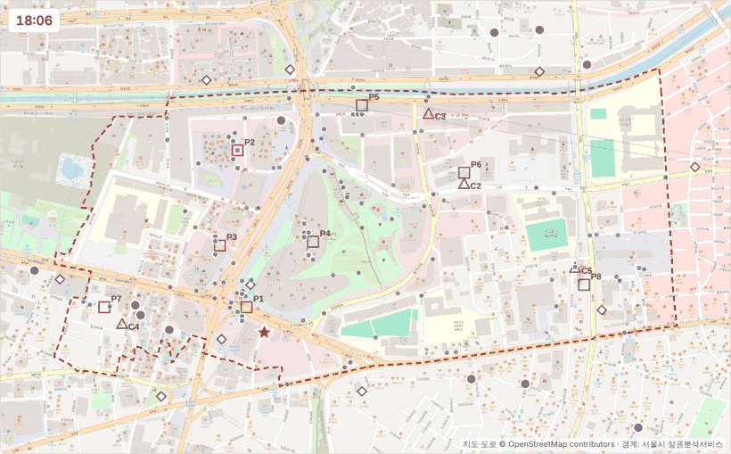
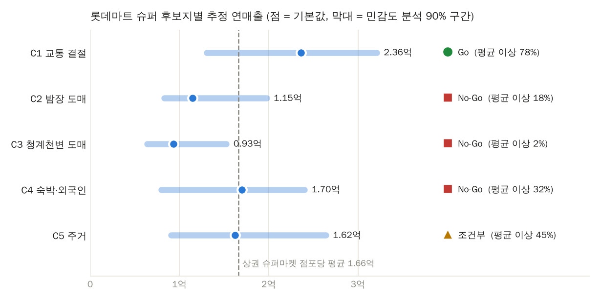

# 7 — 롯데마트 슈퍼 신규 출점 시뮬레이션 (동대문패션타운 관광특구)

> 롯데 그룹의 **롯데마트 슈퍼**(기업형 슈퍼마켓, 구 롯데슈퍼)가 동대문패션타운 관광특구에 새 점포를 낸다면,
> **이 상권에 신규 진출해도 되는가**(1차 목적)와 **어느 자리가 유리한가**를 검토했다.
> 실제 지도·도로망·상권 경계 위에서 LLM 페르소나 에이전트 993명이 지하철 출구와 도로로 들어와 목적지로 걷고,
> 장 볼 일이 있으면 슈퍼마켓에 들른다. 후보지 5곳에 점포를 세웠을 때의 방문(결제)수와 매출을
> 서울시 실제 매출 데이터로 환산해 비교했다.



## 확인할 곳

| 보고 싶은 것 | 위치 |
|---|---|
| **시뮬레이션 실행 (지도 + 에이전트 이동)** | [`district_map.html`](district_map.html) — 저장소를 내려받아 브라우저로 열기 (같은 폴더의 `assets/` 필요, 설치 불필요) |
| **진출 판정·후보지별 방문수·매출** | [`outputs/entry_evaluation.md`](outputs/entry_evaluation.md) |
| **위치 선정 근거 · 주요 타겟 고객 · 맞춤 마케팅** | [`outputs/entry_report.md`](outputs/entry_report.md) (LLM 작성, 판정은 바꾸지 않음) |
| 결론이 LLM 판단·가정에 얼마나 기대는가 (대조실험) | [`outputs/ablation_entry.md`](outputs/ablation_entry.md) |
| 롯데 미입점 상태(BASE)와 비교 | 이 README [아래](#롯데-미입점-상태base와-비교) · [`outputs/entry_evaluation.md`](outputs/entry_evaluation.md) |

GitHub 화면에서 `district_map.html`을 열면 코드만 보인다. 로컬에서 열거나, 저장소 Settings → Pages를 켜면 웹으로 볼 수 있다.

화면에서 할 수 있는 것: 시나리오(BASE·C1-C5)와 요일 고르기, 재생 속도(1×·3×·8×), "장보기 고객만" 보기,
점포·에이전트에 마우스를 올려 페르소나·목적·고른 점포 확인, 오른쪽 표의 후보지를 눌러 시나리오 전환.

## 과제 요구사항과 대응

| 요구사항 | 이 폴더에서 |
|---|---|
| 도시 배경 모델링 + 에이전트가 돌아다니는 도시 | OpenStreetMap 지도 이미지(줌 18) 위에 서울시 공식 상권 경계를 그리고, OSM 도로망(노드 4,955개·122km) 최단경로로 에이전트가 걷는다 |
| 분석한 상권 데이터대로 실제 지도 참고해 배치 | 공식 상권 경계(서울시 영역-상권 SHP), 실제 슈퍼마켓 19곳·지하철 출구·상가·호텔 위치(OSM) |
| 롯데 그룹 신규 점포 최적 위치 + LLM 근거 | 후보지 5곳 비교 → **C1 동대문역사문화공원역 출구 앞**, 근거 문서 [`entry_report.md`](outputs/entry_report.md) |
| 주요 타겟 고객 · 맞춤 마케팅 | [`entry_report.md`](outputs/entry_report.md) 4·5장 (신규점을 고르는 에이전트의 목적·시간대·연령·살 품목 근거) |
| 지표: 방문수 · 매출 | 후보지별 연 결제건수·연매출 (서울시 2025년 실제 슈퍼마켓 결제 건수·객단가로 보정) |
| 1차 목적: 상권 신규 진출 가능 여부 | **Go — C1은 민감도 분석 500회 중 78%에서 점포당 평균 연매출 이상.** 롯데 미입점 상태(BASE)와 비교하면 상권 슈퍼마켓 결제의 1.65%(점포 평균 몫 1.17%의 1.4배)를 가져온다 |

## 결과 요약

**결론: 진출 가능(Go). 최적 위치는 C1 동대문역사문화공원역 출구 앞 을지로변.**
나머지 후보지는 평균에 못 미치거나(C2·C3), 가정에 따라 결과가 흔들려(C4·C5) 권하지 않는다.



| 후보지 | 연 결제건수 | 연매출 (평균 대비) | 민감도 분석 90% 구간 | 평균 이상 비율 | 1위 비율 | 판정 |
|---|---|---|---|---|---|---|
| **C1** 역 출구 앞 을지로변 (교통 결절) | 32,940 | **2.36억 (142%)** | 1.31억-3.21억 | **78%** | **81%** | **Go** |
| C2 마장로 벨포스트-디오트 (밤장 도매) | 16,481 | 1.15억 (69%) | 0.83억-1.98억 | 18% | 1% | No-Go |
| C3 청계천로 신평화-동평화 (청계천 도매) | 13,198 | 0.93억 (56%) | 0.64억-1.53억 | 2% | 0% | No-Go |
| C4 광희동 숙박·음식 거리 | 24,048 | 1.70억 (102%) | 0.80억-2.40억 | 32% | 1% | No-Go |
| C5 다산로 신당동 주거지 쪽 | 23,384 | 1.62억 (98%) | 0.91억-2.64억 | 45% | 17% | 조건부 |

- 기준: 서울시 상권분석서비스 2025년 '슈퍼마켓' — 상권 내 85.8개, 연매출 142.7억, **점포당 평균 1.66억**, 객단가 7,133원.
- 판정 기준(실행 전에 정함): 민감도 분석 500회 중 신규점 연매출이 점포당 평균 이상인 비율이 70% 이상 Go, 40-70% 조건부, 40% 미만 No-Go.
- C1 신규점을 고르는 에이전트의 방문 목적: 식사·야식 53%, 인근 거주·생활 14%, 패션 쇼핑 13%, 관광·구경 12%.
  시간대: 17-21시 23%, 06-11시 18%, 00-06시 17%. 살 품목: 생수·음료·간단한 간식, 야식거리.
- C1이 가져오는 매출은 대부분 OSM에 없는 상권 안 소형 슈퍼마켓 몫이고, 그다음이 Imperia Foods·동대문마트(광희동 쪽 실제 점포)다.

## 롯데 미입점 상태(BASE)와 비교

### 한눈에 비교 — 롯데마트 슈퍼가 없을 때 vs C1에 입점했을 때

같은 에이전트·같은 동선에서 점포 하나만 더했을 때의 연간 값이다 (2025년 실제 결제 건수·객단가로 보정).

| 지표 | 롯데마트 슈퍼 없음 (BASE) | C1 입점 후 | 차이 |
|---|---|---|---|
| 상권 내 슈퍼마켓 수 | 85.8개 | 86.8개 | **+1개** |
| 상권 내 슈퍼마켓 전체 결제 | 2,000,851건 | 2,001,767건 | +916건 (+0.05%) |
| 상권 내 슈퍼마켓 전체 매출 | 142.72억원 | 142.78억원 | +0.06억원 (+0.04%) |
| **롯데마트 슈퍼 결제 · 매출** | 0건 · 0원 | **32,940건 · 2.36억원** | **+32,940건 · +2.36억원** |
| 롯데마트 슈퍼 점유율 (상권 결제 중) | 0% | 1.65% | +1.65%p (점포 평균 몫 1.17%의 1.4배) |
| 기존 점포 전체 결제 · 매출 | 2,000,851건 · 142.72억원 | 1,968,827건 · 140.42억원 | −32,024건 · −2.30억원 (−1.6%) |
| 기존 점포 1곳당 평균 매출 | 1.66억원 | 1.64억원 | −1.6% |
| 가장 가까운 기존 점포 (Imperia Foods, 광희동) 결제 | 31,605건 | 30,806건 | −799건 (−2.5%) |
| 상권 밖 슈퍼마켓으로 나가던 장보기 결제 | 73,671건 | 72,755건 | −916건 (−1.2%) |

- **상권 전체 시장은 거의 그대로다**(+0.04%). 장보기 수요는 점포 위치와 상관없이 같다고 가정했기 때문에, 롯데마트 슈퍼 매출 2.36억원의 대부분(2.30억원, 97%)은 기존 점포에서 옮겨 오고 나머지는 상권 밖으로 나가던 손님이 돌아온 몫이다.
- **기존 점포 입장에서는 평균 1.6% 감소**로 크지 않다. 가장 가까운 점포도 2.5% 줄어드는 정도다.
- 다른 후보지까지 포함한 비교는 아래 표에 있다.

### 현재 상태 — 롯데 계열 슈퍼마켓이 없는 동대문패션타운

| 항목 | 값 (출처) |
|---|---|
| 상권 내 슈퍼마켓 | 85.8개 (서울시 점포-상권, 2025년 분기 평균) — OSM 등록 기준 롯데 계열 슈퍼마켓(롯데마트·롯데마트 슈퍼)은 없음 |
| 슈퍼마켓 연매출 · 결제 | 142.7억원 · 200만 건, 점포당 평균 1.66억원 · 2.3만 건 (서울시 추정매출-상권, 2025년) |
| 결제가 많은 시간대 | 17-21시 22.2%, **00-06시 20.0%**, 06-11시 17.9% — 밤장 도매가 도는 새벽 수요가 큼 |
| 결제 고객 | 남성 59.5%, 30대 33.9% · 20대 20.1% · 40대 19.7% |
| 후보지에서 가장 가까운 OSM 슈퍼마켓 | C1 188m · C2 306m · C3 207m · C4 **41m** · C5 250m |

시뮬레이션의 BASE 시나리오는 이 상태(신규점 없음)에서 장보기 고객 159명이 어느 점포로 가는지 계산하고,
그 결과를 2025년 실제 결제 건수에 맞춘다. 후보지 시나리오는 같은 사람들, 같은 동선에 롯데마트 슈퍼 하나만 더한 것이다.

### 입점하면 무엇이 바뀌나

| 후보지 | 상권 슈퍼마켓 결제 중 신규점 점유 | 기존 점포 1곳당 평균 감소 | 신규점 고객이 원래 가던 곳 (상권 안 / 밖) | 가장 크게 줄어드는 기존 점포 (OSM) |
|---|---|---|---|---|
| **C1** 역 출구 앞 | **1.65%** | 384건 (−1.65%) | 97% / 3% | Imperia Foods −2.5%, 동대문마트 −2.4% (광희동 쪽) |
| C2 마장로 밤장 도매 | 0.82% | 192건 (−0.82%) | 96% / 4% | 동묘식풍·한일유통 −1.7% (상권 밖 북동쪽) |
| C3 청계천 도매 | 0.66% | 154건 (−0.66%) | 95% / 5% | 정아식품 −2.4%, 신흥슈퍼 −2.2% (상권 밖 북쪽) |
| C4 광희동 숙박·음식 거리 | 1.20% | 280건 (−1.20%) | 96% / 4% | 기성키친마트 −4.5%, 동대문마트 −3.8% |
| C5 신당동 주거지 쪽 | 1.17% | 273건 (−1.17%) | 92% / 8% | 하임마트 −5.5%, 은혜마트 −4.8% (신당동) |

- '기존 점포 1곳당 평균 감소'는 신규점 결제를 기존 점포 수(85.8)로 나눈 값이라, 상권 밖에서 온 몫까지 포함해 위 한눈에 비교 표(C1 −1.6%)보다 조금 크다.
- **점포 1곳의 '평균 몫'은 1/85.8 = 1.17%다.** C1은 1.65%로 평균의 약 1.4배를 가져가고, C2·C3는 평균 몫에도 못 미친다.
- **상권 전체 슈퍼마켓 수요는 늘지 않는다고 가정했다**(장보기 여부는 점포 위치와 무관하게 LLM이 한 번만 답함).
  그래서 신규점 매출의 92-97%는 상권 안 기존 점포에서, 나머지는 상권 밖 점포에서 옮겨온다.
- **기존 점포 입장에서 영향은 크지 않다.** C1 입점 시 기존 점포는 평균 1.65%(연 384건) 줄고, 가장 가까운 광희동 쪽 점포도 2.5% 안팎이다.
  반대로 C4는 바로 앞 41m에 기존 점포가 있어 그 점포들이 4-5% 줄어들고, C5는 신당동 주거지 슈퍼마켓들 몫을 가져온다.
- **시간대**: C1 신규점 결제는 17-21시 23%, 06-11시 18%, 00-06시 17%로 상권 전체(새벽 20%)보다 저녁·아침 비중이 높다.
  밤장 쪽 후보지(C2 00-06시 33%, C5 29%)는 새벽 비중이 크지만 전체 규모가 작다.

## 대조실험 — 결론이 무엇에 기대고 있나

같은 에이전트로 조건만 바꿔 다시 계산했다 ([`ablation_entry.py`](ablation_entry.py), 각 200회).

| 조건 | C1 | C4 | C5 | 최적 |
|---|---|---|---|---|
| 실제 LLM 응답 | 2.36억 · Go | 1.70억 · No-Go | 1.62억 · 조건부 | C1 |
| 장보기 여부를 무작위로 섞음 | 2.54억 · Go | 1.35억 · No-Go | 0.97억 · No-Go | C1 |
| 목적을 (같은 시간대 안에서) 섞음 | 2.53억 · Go | 1.43억 · No-Go | 1.03억 · No-Go | C1 |
| 둘 다 섞음 | 2.54억 · Go | 1.42억 · No-Go | 0.97억 · No-Go | C1 |
| 입구 10곳 균등 (지하철 가중치 가정 제거) | 2.48억 · Go | 1.80억 · No-Go | 1.47억 · No-Go | C1 |
| 도로 위주 (지하철 30%) | 2.28억 · Go | 1.60억 · No-Go | 1.58억 · 조건부 | C1 |

- **C1이 1위이고 Go라는 결론은 LLM 판단이나 입구 가중치를 바꿔도 그대로다.**
  C1이 앞서는 이유는 공간 구조다. 3개 노선 환승역 출구, 소매몰(P2·P3), DDP(P4)가 모여 있고, 근처 OSM 슈퍼마켓까지 188m 떨어져 있다.
- **LLM 판단이 바꾼 것은 주거지(C5)·숙박가(C4)다.** LLM이 "근처 주민·식사 손님은 장을 본다"(인근 거주 76%, 식사·야식 30%)고
  답하면서 C5가 0.97억 → 1.62억, C4가 1.35억 → 1.70억으로 올라갔다. 무작위로 섞으면 C5는 No-Go가 된다.

## 설계 — 왜 이렇게 만들었나

| 단계 | 담당 | 이유 |
|---|---|---|
| 누가·언제 상권에 있나 | **실제 데이터** (2025년 유동인구 비율로 추출) | 5주차에서 LLM에게 방문 요일을 물으면 토요일이 74-83%(실제 11.7%)로 쏠렸다 |
| 왜 왔나 · 장 볼 일이 있나 | **LLM** (페르소나를 보고 판단) | 페르소나의 직업·거주지·가족·성향을 반영할 수 있는 부분 |
| 어디서 어디로 · 어느 점포 | **규칙 + 실제 지도** (도로망 최단경로, 허프 모델) | 장소·점포 선택까지 LLM에게 맡기면 한 장소에 몰리고 목록 맨 위 점포를 고르는 경향이 있어서 |
| 방문수 · 매출 | **실제 데이터** (2025년 슈퍼마켓 결제 건수·객단가로 보정) | 시뮬레이션은 '어느 점포로 가는가'의 비율만 책임진다 |

검증 — BASE 시나리오 장보기 고객 구성 vs 실제 슈퍼마켓 결제 구성 (MAE, %p): 연령 7.1 · 성별 16.7 · 시간대 5.1 · **요일 4.1**.
요일 오차는 5주차(LLM에게 방문 요일을 물은 방식) 18-20에서 크게 줄었다.
성별 오차는 크다. 실제 결제는 남성이 59.5%인데 시뮬레이션 장보기 고객은 여성이 57%다.
실제로는 새벽 결제가 20%로 밤장 남성 상인 수요가 큰데, LLM은 새벽 사람들을 주로 '통과'·'식사·야식'으로 답했다
(의류 도매 사입 42명, 상권 내 근무 59명). 연령도 신규점 고객 중 60대 이상이 28% 안팎으로 실제 결제(9.9%)보다 많다.

## 방법

1. **에이전트 (실제 데이터)**: 2025년 추정유동인구의 요일·시간대·연령·성별 비율로 1,000명을 뽑고, 조건에 맞는 Nemotron 페르소나를 붙인다 (항목 간 독립 가정).
2. **LLM 판단** ([`simulate_agents.py`](simulate_agents.py), gpt-5.4-mini, 10명씩 100회): 페르소나·요일·시각과 장소별 운영시간을 주고,
   방문 목적 10개 중 하나와 슈퍼마켓에서 살 것이 있는지(Y/N)·품목을 묻는다. 상권 방문 여부는 묻지 않는다(이미 있는 사람).
3. **동선 (규칙 + 실제 지도)** ([`estimate_entry.py`](estimate_entry.py)): 목적에 맞고 그 시각에 문 연 장소로 배정 → 입구는 가중치 × exp(−거리/500m)로 선택 → 도로망 최단경로.
4. **점포 선택 (허프 모델)**: 장 볼 일이 있는 사람은 들어오는 길 또는 나가는 길에 슈퍼마켓 하나를 들른다. 점포 선택 확률 ∝ 매력도 × exp(−돌아가는 거리/λ).
5. **보정 (실제 매출)**: 시간대마다 BASE(신규점 없음)에서 상권 안 점포로 가는 기대 이용을 2025년 실제 슈퍼마켓 결제 건수에 맞춘 뒤(보정계수 k_t),
   신규점 선택 확률 × k_t × 실제 시간대별 객단가로 연 결제건수·연매출을 낸다.
6. **민감도 분석**: 500회 동안 λ 120-350m, 신규점 매력도 0.67-1.5배, 입구 감쇠 300-800m, 입구·장소 가중치 0.5-1.5배,
   경쟁점 배치(균등/OSM 점포 근처 집중), 에이전트 복원추출을 무작위로 바꾼다.
7. **근거 문서** ([`generate_entry_report.py`](generate_entry_report.py)): 평가 결과·실제 통계·1단계 상권 분석·대조실험만 LLM에 주고, 자료에 없는 숫자는 쓰지 말라고 지시한다.

## 가정과 한계

**데이터에서 온 값**: 요일·시간대·연령·성별 분포, 슈퍼마켓 결제 건수·객단가·점포 수(서울시), 상권 경계(서울시), 도로망·슈퍼마켓·출구·상가 위치(OSM), 장소 운영시간(1단계 상권 분석).
**LLM 판단**: 방문 목적, 장보기 여부·품목.
**가정한 값**: 입구 가중치(지하철 60%·도로 40%), 장소 간 가중치(균등), 허프 거리 감쇠 λ=200m, 신규점 매력도 1.0, OSM에 없는 경쟁점 82곳의 위치 — 모두 민감도 분석·대조실험에서 흔들었다.

### 가정값을 정한 이유

상권 데이터(서울시 상권분석서비스)는 상권 전체의 합계만 주고, 상권 안 어느 입구로 들어와 어느 장소에 머무는지는 주지 않는다.
그래서 아래 값은 정할 수밖에 없었고, 결과에 맞춰 조정하지 않았다. 모두 시뮬레이션을 돌리기 전에 정했고, 실행 후 바꾸지 않았다.

| 가정 | 값 | 이렇게 정한 이유 | 바꿔 봤을 때 |
|---|---|---|---|
| 입구 가중치 | 지하철 출구 60%(동대문역사문화공원역 출구 3곳 각 10%, 동대문역 15%, 신당역 15%), 도로 진입점 5곳 각 8% | 상권에 지하철역 3곳이 붙어 있고, 그중 동대문역사문화공원역은 2·4·5호선 3개 노선 환승역이라 출구를 3곳으로 나눠 가장 큰 몫을 줬다. 나머지 두 역(1·4호선 동대문역, 2·6호선 신당역)은 같게, 도로 5곳도 같게 뒀다. 지하철:도로 비율은 근거 데이터가 없는 가정이다 | 입구 10곳 균등, 도로 위주(지하철 30%)로 바꿔도 C1 Go·1위는 그대로. **C5만 조건부 ↔ No-Go 경계**에 있어 균등일 때 No-Go가 된다 (대조실험 B) |
| 장소 간 가중치 | 균등 | 장소별 방문자 수 데이터가 없어 한 장소에 더 주지 않았다. 목적과 운영시간이 맞는 장소 중에서만 고른다 | 민감도 분석에서 장소마다 0.5-1.5배로 흔듦 |
| 허프 거리 감쇠 λ | 200m | 동네 슈퍼마켓은 몇 분 거리 안에서 고른다는 가정. 200m 더 돌아가면 선택 가능성이 약 1/e(37%)로 준다 | 120-350m로 흔듦 |
| 신규점 매력도 | 1.0 (기존 점포와 같음) | 브랜드·매장 규모에 따른 선호 데이터가 없어 기존 점포보다 유리하게 두지 않았다 | 0.67-1.5배로 흔듦 |
| OSM에 없는 경쟁점 | 82곳을 상권 안 도로에 무작위 배치 | 개수는 서울시 점포 수(85.8) − OSM 상권 내 등록(4)으로 데이터에서 나오지만, 위치 정보가 없다 | 상권 전체 균등 / OSM 점포 근처 집중 두 방식을 섞어 흔듦 |

판정은 이 가정들을 동시에 무작위로 바꾼 500회 중 몇 %에서 점포당 평균 이상인지로 낸다.
그래서 C1의 Go(78%)는 특정 가정값 하나에 기대지 않는다. 반면 C5(45%)는 가정에 따라 판정이 바뀌는 경계에 있다.

- **경쟁점 대부분이 추정 위치다.** OSM에는 상권 안 슈퍼마켓이 4곳뿐이고 서울시 집계는 85.8개라, 82곳을 도로 위에 무작위로 놓았다. 신규점 매출도 대부분 이 추정 점포에서 온다.
- **'슈퍼마켓' 업종 평균(1.66억)은 소형 식료품점을 포함한 값**이다. 기업형 슈퍼마켓의 실제 손익분기와는 다르며, 임대료·인건비는 모델에 없다.
- **표본이 작다.** 장보기 고객 159명으로 후보지별 고객 구성을 낸다. 원단·부자재(6명), 숙박(5명) 목적은 해석하기 어렵다.
- **성별·연령 오차**: 위 결과 비교 참고. 밤장 남성 상인 수요가 과소 반영됐을 가능성이 크다.
- **항목 간 독립**: 원본이 주변 분포만 줘서 '새벽 × 50대 남성' 같은 결합 비율은 반영하지 못한다. 페르소나 최소 나이가 19세라 10대는 19세로만 채워진다.
- **LLM 응답 실패 7명**은 제외했다(993명 사용).
- 도로망의 횡단보도·지하보도 연결, 건물 출입구는 반영하지 않았다.

<details>
<summary>폴더 구조</summary>

```
7_store_entry_simulation/
├── README.md
├── district_map.html              ← 시뮬레이션 (브라우저로 열기)
├── requirements.txt / .env.example / .gitignore
├── common.py                      ← 공통 경로·상수·도로 그래프·점포 로딩
├── prepare_personas.py            ← 페르소나 100만 명 (최초 1회, 176MB라 저장소 제외)
├── prepare_market_data.py         ← 서울시 원본 → data/market_facts.json
├── fetch_osm_data.py              ← OSM 도로·슈퍼마켓 수집 (결과는 data/raw/에 포함)
├── build_road_graph.py            ← OSM 도로 → data/road_graph.json
├── build_background.py            ← OSM 지도 타일 → assets/background.png
├── simulate_agents.py             ← 에이전트 추출 + LLM 판단 (목적·장보기)
├── estimate_entry.py              ← 동선·허프 모델·매출 보정·민감도 분석·판정
├── ablation_entry.py              ← 대조실험 (LLM 기여도, 입구 가중치)
├── generate_entry_report.py       ← LLM 근거 문서 (진출 근거·타겟·마케팅)
├── build_visualization.py         ← 시각화 HTML
├── assets/                        ← 배경 지도 이미지
├── docs/                          ← README용 화면 (simulation.gif/png, compare.png)
├── data/
│   ├── market_facts.json          ← 2025년 실제 유동인구·슈퍼마켓 매출 정리본
│   ├── places.json                ← 목적지 장소 8곳 (좌표·운영시간·가능 목적)
│   ├── entrances.json             ← 입구 10곳 (좌표·가중치 가정)
│   ├── candidate_sites.json       ← 후보지 5곳
│   ├── road_graph.json            ← 보행 네트워크
│   ├── stage1_district_facts.json ← 1단계 상권 분석 (5주차와 같은 파일)
│   └── raw/                       ← 서울시 원본(상권 3001493만 추출), 상권 경계, OSM 원본
├── outputs/
│   ├── agents.csv                 ← 에이전트·LLM 응답
│   ├── llm_cache.jsonl            ← LLM 원본 응답 기록
│   ├── entry_evaluation.json/.md  ← 평가 결과
│   ├── agent_assignments.csv, virtual_stores.json ← 시각화용
│   ├── ablation_entry.md/.csv     ← 대조실험
│   └── entry_report.md            ← 근거 문서
```
</details>

<details>
<summary>다시 실행하려면</summary>

```bash
cd 7_store_entry_simulation
pip install -r requirements.txt
cp .env.example .env                # OPENAI_API_KEY 입력
python prepare_personas.py          # 또는 5주차 data/의 parquet 복사

python simulate_agents.py           # LLM 약 100회 (중간에 끊기면 다시 실행 시 이어서)
python estimate_entry.py            # API 없음
python ablation_entry.py            # API 없음, 1-2분
python generate_entry_report.py     # LLM 1회
python build_visualization.py       # → district_map.html
```
`prepare_market_data.py`, `fetch_osm_data.py`, `build_road_graph.py`, `build_background.py`는 결과가 이미 저장소에 있어 다시 돌릴 필요 없다.
모든 스크립트에 `--mock`을 붙이면 API 없이 규칙 기반 가짜 응답으로 파이프라인만 점검한다(`outputs/mock/`, 커밋 안 함).
</details>

## 출처

- 서울시 상권분석서비스 (data.seoul.go.kr): 추정유동인구-상권 OA-15568, 추정매출-상권 OA-15572, 점포-상권 OA-15577, 영역-상권 OA-15560
- 지도·도로·점포 위치: © OpenStreetMap contributors (ODbL), Overpass API·Nominatim으로 수집 (2026-10-07-08)
- 페르소나: nvidia/Nemotron-Personas-Korea (CC BY 4.0)
- LLM: OpenAI gpt-5.4-mini
